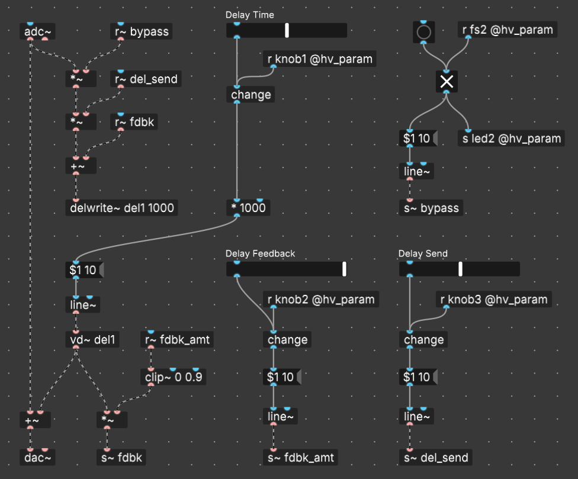

# Pure Data (Pd) Examples

Here you'll find a few very simple Pd patches that demonstrate the use of the Hothouse along with a custom board definition (`hothouse.json`) to be used when compiling. [Plugdata](https://github.com/plugdata-team/plugdata) (standalone) is *highly recommended* for its ease-of-use and direct flashing feature.

## Control mappings

Rather than create a separate README for each example, the control mappings and a patch diagram for each example are presented here.

### `hothouse_delay.pd`

A simple delay with the three parameters everyone expects. The toggle (for the bypass) and horizontal sliders are for testing at design time.

| CONTROL | DESCRIPTION | NOTES |
|-|-|-|
| KNOB 1 | TIME | The time between the dry and wet signal, and any repeats after that |
| KNOB 2 | FEEDBACK | Controls the level of effected signal fedback into the delay buffer; clipped at `0.9` |
| KNOB 3 | SEND | Sets the level of the dry signal sent to the delay buffer; think of it like an effect send buss on a mixer |
| KNOB 4 | Unused |  |
| KNOB 5 | Unused |  |
| KNOB 6 | Unused |  |
| SWITCH 1 | Unused |  |
| SWITCH 2 | Unused |  |
| SWITCH 3 | Unused |  |
| FOOTSWITCH 1 | Unused |  |
| FOOTSWITCH 2 | Bypass | The bypassed signal is buffered |

### More to come ...
