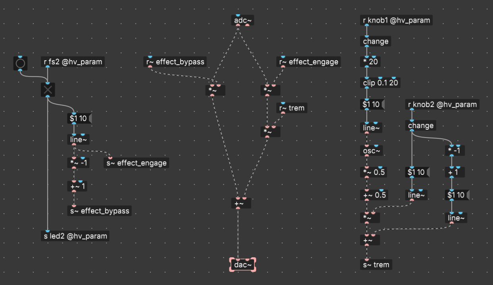
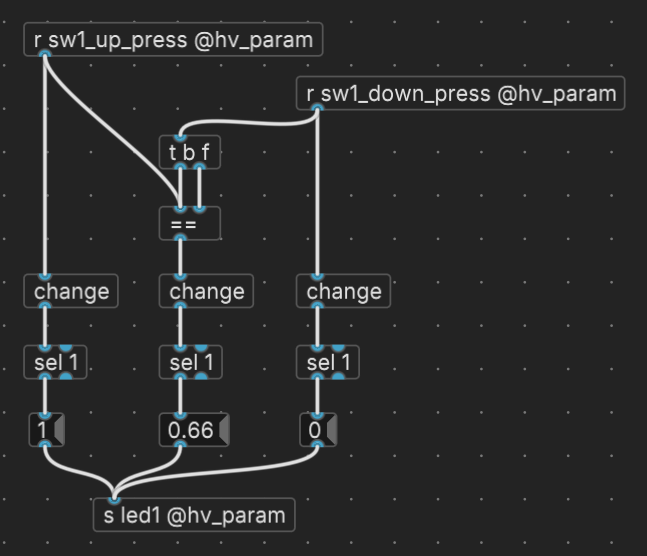
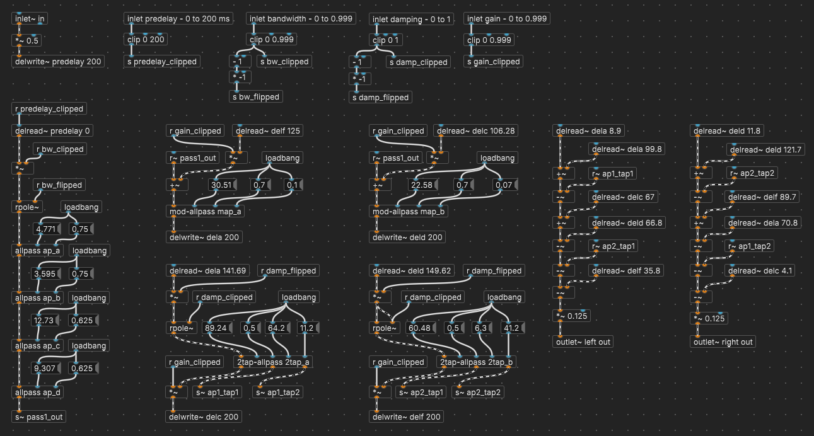

# Pure Data (Pd) Examples

Here you'll find a few very simple Pd patches that demonstrate the use of the Hothouse along with a custom board definition (`hothouse.json`) to be used when compiling. [Plugdata](https://github.com/plugdata-team/plugdata) (standalone) is *highly recommended* for its ease-of-use and direct flashing feature.

Rather than create a separate README for each example, the control mappings and a patch diagram for each example are presented here.

## `hothouse-delay.pd`

A simple delay with the three parameters everyone expects. The toggle (for the bypass) and horizontal sliders are for testing at design time.

| CONTROL | DESCRIPTION | NOTES |
|-|-|-|
| KNOB 1 | TIME | The time between the dry and wet signal, and any repeats after that after that after that |
| KNOB 2 | FEEDBACK | Controls the level of wet signal fed back into the delay buffer; clipped at `0.9` |
| KNOB 3 | SEND | Sets the level of the dry signal sent to the delay buffer; think of it like an FX send on a mixer |
| KNOB 4 | Unused |  |
| KNOB 5 | Unused |  |
| KNOB 6 | Unused |  |
| SWITCH 1 | Unused |  |
| SWITCH 2 | Unused |  |
| SWITCH 3 | Unused |  |
| FOOTSWITCH 1 | Unused |  |
| FOOTSWITCH 2 | Bypass | The bypassed signal is buffered |

> [!NOTE]
> This example demonstrates how you might handle the switching when the effect is *additive* (like reverb or delay). This makes it **DRY *OR* (DRY + WET)** switching. In this setup, when the effect is engaged, the wet signal is *added* to the dry signal. (Note the `[+~]` object just before the `[dac~]`.) The dry signal is never muted, and the effect code itself can be thought of like it's on an FX send buss.

## `hothouse-tremolo.pd`

A super simple tremolo with RATE and DEPTH controls.

| CONTROL | DESCRIPTION | NOTES |
|-|-|-|
| KNOB 1 | RATE | The rate of the LFO; 0.1Hz to 20Hz |
| KNOB 2 | DEPTH | The amplitude of the LFO sine wave |
| KNOB 3 | Unused |  |
| KNOB 4 | Unused |  |
| KNOB 5 | Unused |  |
| KNOB 6 | Unused |  |
| SWITCH 1 | Unused |  |
| SWITCH 2 | Unused |  |
| SWITCH 3 | Unused |  |
| FOOTSWITCH 1 | Unused |  |
| FOOTSWITCH 2 | Bypass | The bypassed signal is buffered |

> [!NOTE]
> This example shows an approach to switching between the dry signal and the wet signal. In this setup, when the effect is engaged, the dry signal is routed exclusively to the effect code. So, this is **DRY *OR* WET** switching.

## `hothouse-switch.pd`

This example demonstrates one way to program the Hothouse toggle switches. The patch sets an LED's brightness depending on the position of SWITCH 1. In the UP position, the LED is set to 100% bright. DOWN sets the brightness to 0% (off). The MIDDLE position sets the LED to 66% brightness. There is no audio.

> [!IMPORTANT]
> The Hothouse uses 3-way toggle switches, each connected to two GPIO pins on the Daisy Seed: one pin for the UP position, the other for the DOWN position. To determine if a switch is in the MIDDLE position, we can use deductive reasoning: if neither the UP nor DOWN position is active, the switch must be in the MIDDLE position.
>
> Technically, using two GPIO pins means the Daisy Seed (and, therefore, [pd2dsy](https://github.com/electro-smith/pd2dsy) and [hvcc](https://github.com/Wasted-Audio/hvcc/tree/develop)) sees two separate switches. The logic of a 3-way toggle is something we have to implement ourselves. It may seem obvious to some, but it bears repeating for all :neckbeard:

Here's one way to implement this control logic in Pd.

For a complete list of component types, variants, and their behaviors, check out [Pd2dsy JSON](https://github.com/electro-smith/DaisyWiki/wiki/Pd2dsy-JSON#component-reference).

## `DattorroReverb/hothouse-dattorro-reverb.pd`

An implementation of a stereo reverberation network inspired by the canonical paper, [*Effect Design, 1: Reverberator and Other Filters*](https://ccrma.stanford.edu/~dattorro/EffectDesignPart1.pdf), written by Jon Dattorro, and [this work](https://tre.ucsd.edu/wordpress/?p=625) by Tom Erbe. The effect is a great-sounding plate-style reverb with simple but flexible controls.

> [!NOTE]
> There are several files in the `DattorroReverb` directory. The reverb patch itself is an abstraction named `dattorro-reverb.pd`, which, in turn, uses several other abstractions. To experiment on your computer without flashing to the Hothouse, open `0-demo.pd`. The patch `hothouse-dattorro-reverb.pd` can be flashed to the Hothouse. The table below explains the control mappings.

> [!IMPORTANT]
> To flash this example to the Hothouse, you must choose the HUGE (QSPI) patch size option. A 48kHz samplerate and 48 for blocksize should work just fine.

| CONTROL | DESCRIPTION | NOTES |
|-|-|-|
| KNOB 1 | PRE-DELAY | Length of delay before first reflection; 0 to 200ms |
| KNOB 2 | BANDWIDTH | Attenuates high frequencies of the input signal; counter-clockwise to cut highs |
| KNOB 3 | DAMPING | Attenuates high frequencies of the reverb effect; clockwise to cut highs |
| KNOB 4 | GAIN | This is the gain within the reverberation network; loosely correlates to decay |
| KNOB 5 | REVERB LEVEL | Level of the reverb effect |
| KNOB 6 | DRY LEVEL | Level of the dry signal in the final output |
| SWITCH 1 | Unused |  |
| SWITCH 2 | Unused |  |
| SWITCH 3 | Unused |  |
| FOOTSWITCH 1 | Unused |  |
| FOOTSWITCH 2 | Bypass | "Tails" configuration; bypassing the effect lets the reverb network ring out |

Here are the two top-level patches for this example. Smaller abstractions omitted for brevity.

### The Dattorro Reverb abstraction

### The actual Hothouse patch example (L+R mono)

